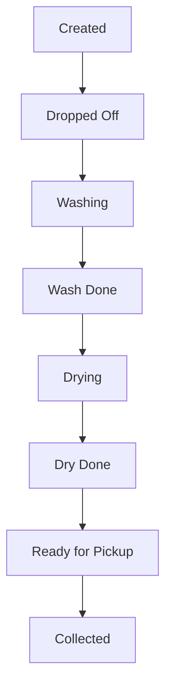

# 🧼 WashOS: The Ultimate Laundry Workflow Engine

[](https://github.com/vignesh/Solve-a-thon)
[](https://github.com/vignesh/Solve-a-thon)

WashOS is a production-grade laundry management ecosystem designed to eliminate the chaos of campus laundry cycles. Built with a "Security-First, User-Always" philosophy, it streamlines the journey from dirty laundry to freshly folded clothes through a robust, QR-powered automated workflow.

---

## ✨ The "Good Shi" (Core Features)

### 🔐 Secure QR Identity System
Forget manual entries. Every student gets a **persistent, cryptographically signed QR identity**. 
- **Anti-Forgery:** Server-side signature validation on every scan.
- **Smart Rotation:** Manual rotation allowed only when no active booking exists.
- **Physical & Digital:** Print your QR for your bag or scan it directly from the app.

### 🔄 End-to-End Lifecycle Tracking
Real-time visibility into every stage of the laundry process:
- `Dropped Off` → `Washing` → `Wash Done` → `Drying` → `Dry Done` → `Ready for Pickup` → `Collected`
- **Audit Trails:** Immutable event logs for every status transition, ensuring accountability.

### 🛡️ Machine Invariant Locking
No more machine hogging. WashOS enforces strict machine management:
- **One Bag, One Machine:** Prevents multiple bags from "ghosting" a single machine run.
- **Transactional Safety:** DB-level locks ensure machine availability is checked before a run starts.

### 🔔 Instant Push Notifications
Never guess when your laundry is done. Students receive **Expo Push Notifications** the moment a staff member marks a bag as `Ready for Pickup`, including the exact **Row Number** for retrieval.

---

## 📅 Smart Scheduler & Peak Flexibility

WashOS features an intelligent scheduling engine designed to maximize throughput while maintaining order.

### 🛠️ Working Days Alignment
The scheduler is strictly mapped to facility working days, preventing weekend bottlenecks and ensuring staff availability aligns with student drop-offs.

### ⚡ Post-12 PM "Floor-Hoping" Flexibility
One of our most powerful features:
- **Primary Slot:** Each floor has its dedicated morning slots to ensure fair access.
- **Flexible Peak:** After **12:00 PM**, if there are unbooked or unused slots, the system automatically opens them to **students from other floors**.
- **Result:** Maximum machine utilization and a "win-win" for students looking for quick turnarounds.

---

## 🚀 Tech Stack

| Layer | Technology |
| :--- | :--- |
| **Backend** | Go (Golang) + Fiber Framework |
| **Database** | PostgreSQL + sqlc (Type-safe queries) |
| **Mobile App** | React Native + Expo |
| **Authentication** | JWT (Role-Based Access Control) |
| **Notifications** | Expo Push Services |

---

## 🏗️ System Architecture

WashOS uses a **State Machine Architecture** to manage laundry bookings. This ensures that a bag can never skip a stage (e.g., jump from `Dropped Off` to `Ready` without being `Drying`).



---

## 🛠️ Getting Started

### Prerequisites
- **Go** 1.21+
- **Node.js** & **npm**
- **PostgreSQL**
- **Expo CLI**

### Fast Setup
1. **Clone the repo:**
   ```bash
   git clone https://github.com/vignesh/Solve-a-thon.git
   cd WashOs
   ```
2. **Server Init:**
   ```bash
   cd server
   go mod download
   # Set your .env
   go run cmd/api/main.go
   ```
3. **Client Init:**
   ```bash
   cd client
   npm install
   npx expo start
   ```

---

## 🛡️ Security Protocol
- **Bcrypt Hashing:** Passwords are never stored in plain text.
- **Role Guards:** Strict separation between `student` and `laundry_staff` endpoints.
- **Versioned QRs:** Prevents replay attacks using stale tokens.

---

*WashOS — Because your time is too valuable to spend in the laundry room.*
